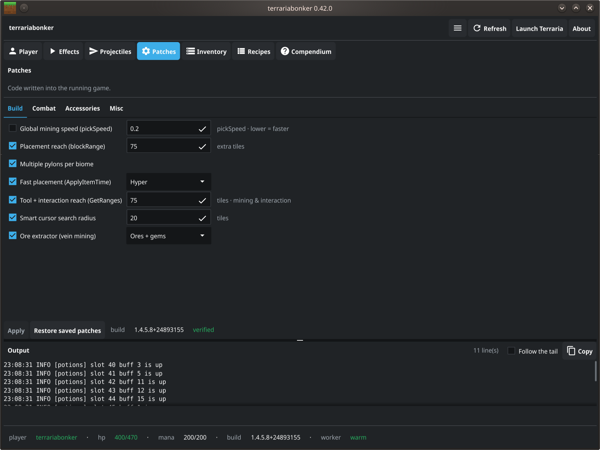

# terrariabonker

A from-scratch live-memory trainer and item editor for **Terraria 1.4.5.8 and
1.4.5.7** (Steam appid 105600), running under Linux/Proton (wine-mono).
It finds the player in memory with no hardcoded address, then reads, edits and
freezes player state and inventory items by reading and writing
`/proc/<pid>/mem`. A GUI control panel drives the same operations as the CLI.

Discovery, value edits, and the *code patches* all run from Python over `/proc`. 
External debuggers and disassemblers such as Cheat Engine are used off to the
side in order to re-derive patch offsets after a game update. See
[Two kinds of cheat](#two-kinds-of-cheat-value-edits-and-code-patches).

*This edits your own single-player game in memory. It writes nothing to disk and
holds no state.*





## Table of Contents

- [What it can do](#what-it-can-do)
- [Two kinds of cheat](#two-kinds-of-cheat-value-edits-and-code-patches)
- [Requirements](#requirements)
- [Installation](#installation)
- [Usage (CLI)](#usage-cli)
- [Usage (GUI)](#usage-gui)
- [Version safety](#version-safety)
- [Project layout](#project-layout)
- [Testing](#testing)
- [Safety](#safety)

## What it can do

**Player**

- **Godmode** and **infinite mana** — hold HP and mana at full.
- **Stat edits** — set current and maximum HP and mana.
- **Fast mining** — every pickaxe to Picksaw speed and power, in one click.
- **Long reach** — place blocks further away.

**Items**

- **Grid item editor** — an inventory grid mirroring the in-game layout. Click a slot to
  edit its item, stack, damage, defense, modifier, auto-reuse, use speed, pickaxe power
  and placement reach; click an empty slot to place a fully-statted item. Modifiers are a
  named dropdown filtered to the item's damage class, and a modified item shows its
  modifier in its name and a colour-coded dot in the grid.
- **Give items by name** — type-ahead over all 6,195 item names.
- **Recipe browser** — an icon grid of every craftable item with live search. Click one for
  its ingredients and crafting station, and toggle between how an item is made and what it
  can be used to make. Terraria has no such browser of its own.
- **Compendium** — every item (6,195) and NPC (759) in the game, not just craftable ones.
  Sort by damage, defense, life or rarity, filter by kind or name, and see each entry's
  tooltip, sprite and a link to the wiki. Items can be given to you; NPCs can be spawned
  beside you at a distance you choose. Bosses ask twice — a confirmation naming the boss,
  then a countdown you can cancel.
- **Projectile editor** — change what one weapon's shots do while you play: pass
  through blocks, pierce more enemies, travel faster, be bigger, or last longer.

**Cheats that change how the game behaves**

| | |
| :--- | :--- |
| Global mining speed | every pickaxe swings faster |
| Placement reach | place blocks at a distance, whatever the item |
| Tool + interaction reach | mining, tools, chests, signs and crafting stations all reach further |
| Fast placement | blocks go down as fast as you can click |
| Item pickup range | pull items in from off-screen |
| Spawn rate | more enemies, or none at all |
| Drop-chance floor | make common drops guaranteed, or set a minimum |
| Map-ping teleport | double-click the fullscreen map to warp there |
| Minion cap | raise the summon limit |
| Smart-cursor radius | keep auto-place responsive at long reach |
| Multiple pylons per biome | build a pylon network with several of the same type |
| [Ore extractor](#ore-extractor-vein-mining) | break one ore and the vein goes with it |
| [Vanity accessories](#working-vanity-accessories) | the seven vanity slots grant their effects |
| Accessories from inventory | accessories work without being equipped |
| [Passive potions](#passive-potions) | favorite a potion and its effect stays up |
| [Fishing](#fishing) | a rod, bait that lasts, and fish that bite at once |
| [Fishing potion effects](#fishing) | fishing power, sonar and crates without the potions |
| [Auto-catch](#fishing) | it reels in for you, and casts again |
| [Auto-use](#auto-use) | lets a cheat press your use button |
| [Auto-sell](#auto-sell) | items you pick a list of turn into coins |

### Auto-sell

Pick the items you never want to keep and they turn into coins as you pick them up.

Right-click any item in the **Inventory** tab to put it on the sell list, and right-click
it again to take it off. The list is by item, not by slot, so it keeps working on
everything of that kind you find later, and it is remembered between sessions. Items on
the list are marked in the grid.

**Favorite anything you want to keep.** A favorited stack is never sold, even when it is
on the list — alt-click it, the same way you protect a potion. That is the per-stack
override, and it is worth using before you switch this on.

The coins go into your piggy bank when you can reach one — either you are carrying a
Piggy Bank or a Money Trough, or you have one placed in the world you are in. Otherwise
they go into your own inventory, so nothing ends up somewhere you cannot get at. You get
the plain shop rate; there is no shopkeeper involved, so this works in a world with no
town at all.

**Items worth nothing are destroyed, not sold.** Put a worthless junk drop on the list and
it is binned as it arrives; you get no coins for it, because it is worth none. That is
useful on purpose, but it means the sell list is a delete list for anything valueless.

**Selling is permanent.** Once your world saves, the items are gone — there is no undo.
Switch it on under **Effects**, or run `terrariabonker sell --watch`. `terrariabonker sell
--dry-run` tells you what it would sell and sells nothing.

### Passive potions

Alt-click a potion to favorite it and its effect stays up while the potion sits in your
bag. Nothing is drunk and the stack never shrinks.

Only favorited potions count, so the ones you pick up along the way stay inert until you
say otherwise. Set a minimum stack size if you would rather a single spare potion did not
switch anything on. Potions you drink normally are untouched — a passive effect never
shortens one you took yourself.

This one needs the trainer running: close it and the buffs lapse on their own within a
couple of seconds. Find it under **Effects**, or run `terrariabonker potions --watch`.

### Fishing

Switch it on and you get a fishing rod and bait if you have none, and your bait stops
running out — any stack below the number beside the toggle is topped back up as you fish.

It leaves gear you already own alone: your own rod is the one you chose, so it stays.

Some casts come back empty — the line breaks now and then and the bait goes with it. That
is the game, not the cheat, and High Test Fishing Line stops it. Your bait is topped back
up either way.

**Rod power** is the other half. Every rod you carry is raised to the number you set, and
put back to what it was when you switch the cheat off — including after a crash, because
the original is written down rather than remembered. Power is also what makes fish bite:
at 255 they bite roughly once a second, where a starting rod can leave you waiting.

**The fishing potions, without the potions.** Three switches beside the cheat — **Fishing
power**, **Sonar** and **Crates** — hold what those potions grant for as long as they are
ticked. Sonar names what is biting before you reel it in; Crates brings up more crates;
Fishing power adds 15 on top of whatever your rod has.

If you have actually drunk the potion, or you are holding it up with the passive-potions
cheat, that wins: your eight minutes are left alone rather than being cut down to what this
renews on. Untick a switch and the effect fades a couple of seconds later on its own,
exactly as walking away from a campfire does.

**Fish in a lake, not a puddle.** Water smaller than about 300 tiles cuts your fishing
power sharply, and a tiny pond costs you most of it — that is the game's own rule, not
something the trainer can help with. A big lake catches far more than a small one whatever
gear you carry.

**It can fish for you.** Tick **Reel in for me** and every bite is taken the moment it
happens — you cast, it reels. Tick **and cast** as well and it casts again after each catch,
so a single cast from you turns into a session: twenty-odd fish while you do something else.

It stops on its own the moment you put the rod away. Switch to a pickaxe and it will not
press anything; pick the rod back up and cast, and it carries on. There is no toggle to
remember.

Auto-catch needs **Auto-use** switched on under Patches — that is the part that presses the
button, and it ships off. Reeling for you also means the fish, crates and the occasional
angry NPC all arrive faster than you might expect.

Under **Effects**, or `terrariabonker fishing --watch` and `terrariabonker catch --recast`.

### Auto-use

Presses your use button — the same thing a mouse click does — once, on a frame the trainer
picks. On its own it does nothing at all: nothing presses it until another cheat asks, and
today the only one that asks is auto-catch.

It ships switched off, and it is worth saying plainly why: "use the held item" is whatever
you are holding. With a rod it fishes. With a sword it swings, and with a pickaxe it mines.
Auto-catch will not press unless a rod is in your hand, but the switch itself is not
fishing-specific.

Your own clicking is untouched while nothing is arming it.

### Ore extractor (vein mining)

Break one ore block by hand and the rest of that vein goes with it, at whatever range your
reach cheat gives you. It follows the ore you actually broke, so copper touching iron does
not take both, and it will not wander into a separate deposit nearby.

Silt, slush, desert fossils and obsidian are swept by default — obsidian forms where water
runs into lava, so expect the lava that made it to still be there. Gems are opt-in: `--gems`
on the CLI, or the **Ores only / Ores + gems** choice beside the panel toggle. Run it with
`terrariabonker extract --watch`, or tick **Ore extractor (vein mining)** in the panel.

**This one is not reversible.** Every other cheat is a memory change you undo by switching
it off; a mined tile is a permanent change to your world.

### Working vanity accessories

Terraria draws seven more accessory slots than it uses. Info accessories like a Depth Meter
have always worked in the vanity column, but wings, boots, defense and damage do nothing
there.

This cheat makes the vanity slots grant their effects too, doubling your usable accessory
slots using slots the game already draws and already saves. Vanity *armour* is unaffected.

A companion cheat, **accessories from inventory**, goes further: accessories anywhere in
your bag grant their effects without being equipped, modifiers included. Both can be on at
once, and the same accessory in two places applies twice.

### Projectile editor

Change what the shots from one weapon actually do. Pick a weapon on the **Projectiles**
tab, and set any of:

- **Pass through blocks** — shots ignore terrain
- **Enemies pierced** — how many enemies one shot goes through, or infinite
- **Extra ticks per frame** — how fast the shot travels
- **Size**
- **Lifetime** — how long a shot lives before it fades

The panel tells you which projectile the weapon fires, and warns you when two weapons share
one, because editing that projectile changes both.

Nothing here is written into your save. Shots are built fresh by the game every time you
fire, so the trainer holds the changes while it runs and the next shot after you close it
is normal again.

Two things worth knowing. **Lifetime is set once per shot rather than held**, because a
shot that can never expire never frees its slot and the game only has room for so many at
once. And lifetime is often the setting you actually want for getting through a wall: some
weapons already ignore terrain but burn through their life very fast while inside it, so
raising the lifetime is what carries them out the other side.

## Two kinds of cheat: value edits and code patches

Some things are just numbers in memory — HP, a stack count, an item's damage. Writing them
is enough.

Others are recalculated by the game every frame, so a written value is overwritten before
you notice. Mining speed, reach and pickup range work that way. Those need the game's own
code changed instead, so the value holds.

Both are the same kind of write to the same place, which is why one tool does both. Where a
cheat sits determines how it behaves: a value edit lasts until the game recomputes it, a
code patch lasts until you switch it off or restart the game.

**Credit:** the pickup-range, spawn-rate, drop-chance and map-ping teleport cheats were
ported from the FearLess Forums **TerrariaReGrind** Cheat Engine table, which targets
1.4.5. The sites were re-derived here for 1.4.5.7/.8. Reverse-engineering credit for those
hooks belongs to the ReGrind authors.

## Requirements

- Terraria running under **Proton**. Force it in Steam under Properties → Compatibility.
  The cheats are derived against Proton's **wine-mono** runtime and require it.
- Python 3.10+ (the system one, `/usr/bin/python3`, not conda).
- `numpy`, `PyQt6`, `Pillow` — on Arch/CachyOS `python-numpy python-pyqt6 python-pillow`,
  otherwise `pip install -r requirements.txt`.
- **Passwordless sudo.** Reading another process's memory needs root. The GUI itself stays
  unprivileged and shells each action out, so it cannot answer a password prompt — without
  a NOPASSWD rule the trainer and inventory do nothing (the panel says so, and the browser
  tabs still work). Grant it with `sudo visudo`:

  ```
  youruser ALL=(root) NOPASSWD: /usr/bin/python3 /path/to/terrariabonker/terrariabonker.py *
  ```

  That grants only this program. The CLI works without it, prompting for a password.

## Installation

```bash
cd ~/git/ag-scripts/terrariabonker
./install.sh
```

Installs a `terrariabonker` command and a desktop entry. Nothing is copied — it points at
this checkout, so `git pull` updates it. Remove with `./uninstall.sh`.

## Usage (CLI)

```bash
terrariabonker status              # find the player, show HP/mana
terrariabonker version             # detected build and compatibility

terrariabonker godmode             # pin HP to max; Ctrl-C to stop
terrariabonker freeze --godmode --mana
terrariabonker set-hp max          # heal to full
terrariabonker set-max-hp 500

terrariabonker inventory           # list your inventory
terrariabonker set-stack 40 9999   # set a slot's quantity
terrariabonker set-item 0 3507 --damage 200 --auto-reuse 1
terrariabonker fast-mining         # speed + power on all pickaxes
terrariabonker long-reach --tiles 25

terrariabonker patch status                        # which cheats are on
terrariabonker patch enable mining --value 0.15    # lower = faster
terrariabonker patch enable reach --value 30       # extra tiles
terrariabonker patch enable tool_reach --value 40
terrariabonker patch enable pickup --value 50
terrariabonker patch enable teleport
terrariabonker patch enable max_minions --value 10
terrariabonker patch disable fast_place

terrariabonker patch enable ore_extract
terrariabonker vein                # DRY RUN: what would be mined, writes nothing
terrariabonker extract             # mine the vein at your tile (CHANGES YOUR WORLD)
terrariabonker extract --watch     # break one ore and its vein follows

terrariabonker fishing-buffs --power --sonar --crate --watch

terrariabonker patch enable auto_use
terrariabonker catch               # reel in every bite; you cast
terrariabonker catch --recast      # and cast again after each one

terrariabonker restore             # re-apply your saved cheats and item edits
terrariabonker extract-recipes     # rebuild the recipe database after a game update
terrariabonker extract-sprites     # rebuild the icon cache after a game update
```

`--value` overrides the default. `fast_place`, `teleport`, `pylons`, `ore_extract` and
`auto_use` are on/off only. `catch` needs `auto_use` enabled and stops pressing as soon as
you are not holding a rod. `vein` only reads — use it to see what `extract` would take before letting it
loose on a world you care about.

## Usage (GUI)

Launch from the application menu, or `terrariabonker gui`.

- **Auto-restore** — the panel remembers the cheats you want and your item edits, and
  re-applies them whenever a fresh game appears. This is what makes item stat edits survive
  a save and reload.
- **Launch Terraria** — starts the game through Steam if it is not already running.
- **Trainer** — godmode and infinite mana, heal and refill, max HP/mana, fast mining, long
  reach, and the cheat toggles grouped into **Build / Combat / Accessories / Misc**, with a
  value beside each where one applies.
- **Inventory** — the grid, with each slot showing its sprite, stack count, a border tinted
  by rarity, and a tooltip. Click a slot to edit it, or an empty one to place an item. The
  grid follows the game about once a second, and an edit is **refused** if the slot changed
  underneath it rather than overwriting whatever is really there.
- **Recipes** — the icon grid and search. **Re-extract from game** rebuilds it after an
  update.
- **Compendium** — the item and NPC catalog. Double-click an entry for its stats, a wiki
  link, and **Give** or **Spawn**.

**Persistence note.** Terraria saves an item as only its type, stack and modifier, and
rebuilds everything else from the type on load — so edits to damage, use speed, pickaxe
power, defense, reach and auto-reuse are session-only as far as the game is concerned.
Auto-restore re-applies them on reload. Edits follow the **item**, not the slot, so moving
an edited weapon keeps it.

Only one panel runs at a time. The window reopens at the size you left it, and on KDE its
position is remembered too.

## Version safety

Developed and tested on **1.4.5.8**, and on **1.4.5.7** before it — except the ore
extractor and multiple pylons, which are 1.4.5.8 only.

A cheat is tied to the exact version it was built against, so the tool checks what you are
running:

- **a version it knows** — proceeds;
- **a version it does not** — still runs, but tells you first. It checks every cheat
  against the new version without changing anything, then you carry on with whatever still
  works (the rest greyed out, with the reason) or exit;
- **once the cheats are confirmed working there** — that version joins the supported list
  and it stops asking.

*Accepted* and *supported* are different claims, deliberately. Accepting a version means
the cheats still appear to fit it. Supported means someone watched each one work. The panel
marks a cheat unproven rather than implying it has been tested.

When a cheat does break on a new version, it is rebuilt for that version and added
alongside the old one, so the previous version keeps working. Support accumulates; old
versions are dropped only deliberately.

| Situation | Behaviour |
| :--- | :--- |
| A known version | proceeds |
| A hotfix, or the same version rebuilt | warns, proceeds |
| Version not readable yet (just launched) | reports unknown, retries |
| A different Terraria release (`1.4.6`, `1.5.x`) | refuses without `--force` |

`terrariabonker build-check` runs the same check from the command line. After a Terraria
update, see [docs/discovery.md](docs/discovery.md).

## Project layout

```
terrariabonker/
├── terrariabonker.py           entry point
├── terrariabonker/
│   ├── proc.py                 process memory access and privilege elevation
│   ├── locate.py               finds the player in memory
│   ├── player.py               player stats
│   ├── inventory.py            inventory and item fields
│   ├── trainer.py              godmode and infinite mana
│   ├── patcher.py              the cheats that change game behaviour
│   ├── tiles.py                world tiles and vein finding
│   ├── service.py              shared core behind the CLI and GUI
│   ├── version.py              version detection and the compatibility gate
│   ├── profile.py              your saved cheats and item edits
│   ├── recipes.py              recipe database
│   ├── content.py              item and NPC catalog
│   ├── npcs.py                 NPC data
│   ├── sprites.py              item and NPC icons
│   ├── xnb.py                  reads the game's own sprite files
│   ├── names.py                item names
│   ├── prefixes.py             modifier names
│   ├── data/                   name and tooltip tables, extracted from the game
│   ├── cli.py                  the command line
│   └── gui/                    the control panel
├── tools/                      helpers: sprite extraction, screenshots
├── docs/discovery.md           how the offsets were found, and how to rebuild them
├── ce/                         notes from the reverse-engineering work
├── specs/                      feature specs
└── tests/                      test suite (no game, no root)
```

## Testing

```bash
QT_QPA_PLATFORM=offscreen /usr/bin/python3 -m pytest tests/ -q
```

Tests run against a fake in-memory process, so they need neither the game nor root.

## Safety

- Nothing is written to disk and no state is kept. Edited values are ordinary game values
  the game carries on managing.
- Godmode holds your HP rather than making you invulnerable, so a single hit larger than
  your current HP can still land. Raise max HP for headroom.
- **The ore extractor changes your world permanently.** Try it somewhere you do not mind
  losing.
- Item **consumable** is deliberately not editable: setting it on a single item makes the
  game eat it on use.
- Do not `--force` past an incompatible version. Cheats built for another release can write
  into the wrong place.
