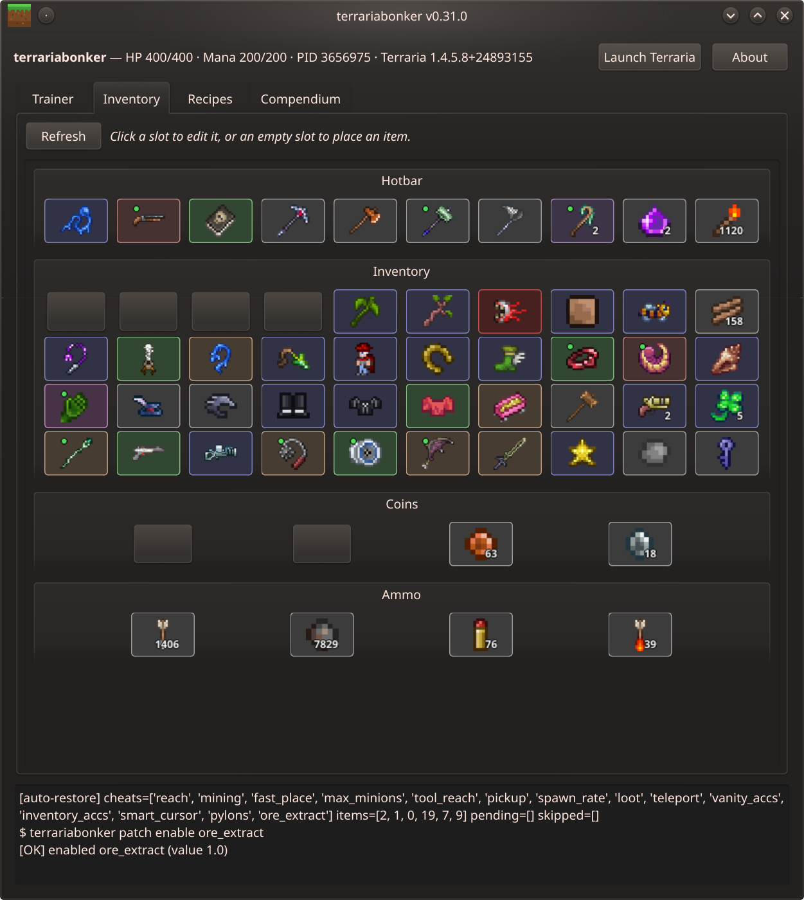
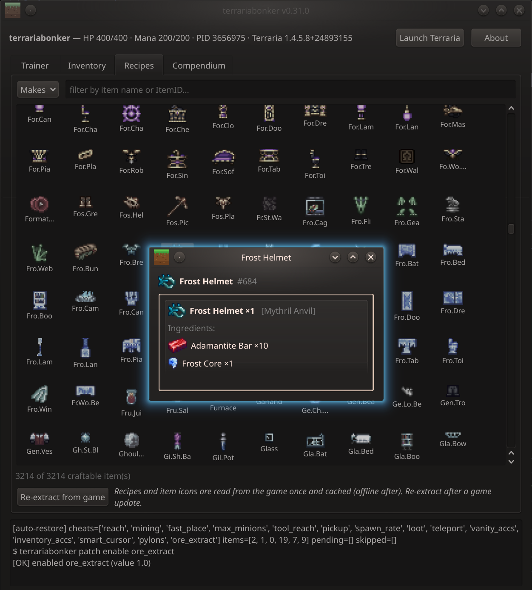
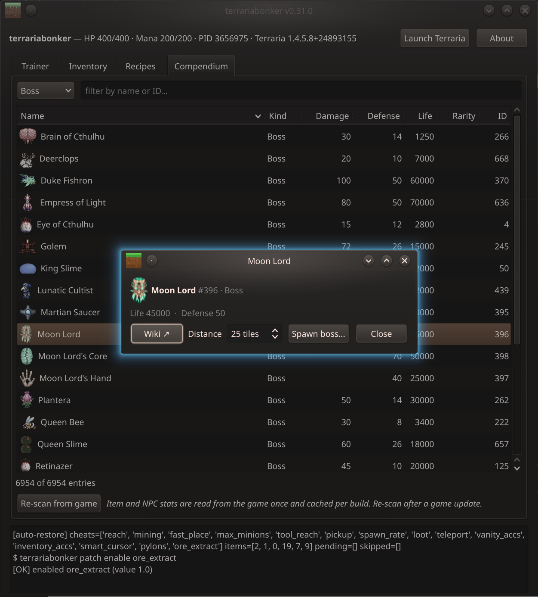

# terrariabonker

A from-scratch live-memory trainer and item editor for **Terraria 1.4.5.8 and
1.4.5.7** (Steam appid 105600), the Windows build running under Proton (wine-mono).
It finds the player in memory with no hardcoded address, then reads, edits and
freezes player state and inventory items by reading and writing
`/proc/<pid>/mem`. A PyQt6 control panel drives the same operations as the CLI.

No Cheat Engine required at runtime: discovery, value edits, and the *code
patches* all run from Python over `/proc`. Cheat Engine is used only off to the
side, to re-derive patch offsets after a game update — see
[Two kinds of cheat](#two-kinds-of-cheat-value-edits-and-code-patches).

*This edits your own single-player game in memory. It writes nothing to disk and
holds no state; stopping it ends every effect.*








## Table of Contents

- [What it can do](#what-it-can-do)
- [Two kinds of cheat](#two-kinds-of-cheat-value-edits-and-code-patches)
- [Requirements](#requirements)
- [Installation](#installation)
- [Usage (CLI)](#usage-cli)
- [Usage (GUI)](#usage-gui)
- [Version safety](#version-safety)
- [How it works](#how-it-works)
- [Project layout](#project-layout)
- [Testing](#testing)
- [Safety](#safety)

## What it can do

- **Godmode** and **infinite mana** — high-frequency freezes that hold HP/mana.
- **Stat edits** — set current and permanent-max HP and mana.
- **Grid item editor** — an inventory grid that mirrors the in-game layout
  (Hotbar / Inventory / Coins / Ammo). Click a slot to open an editor dialog for
  item **type** (ItemID), **stack**, **damage**, **defense**, **modifier** (prefix),
  **auto-reuse** (auto-attack), **use-speed**, **use-animation**, **pickaxe
  power**, and **placement reach**; click an empty slot to place a fully-statted
  item, or clear a slot. The **modifier** is a named dropdown filtered to the item's
  damage class — melee, ranged, magic, and summon weapons and accessories each offer
  only their own modifiers; a modified item shows the modifier in its name (e.g.
  *Fabled Slime Staff*) and a colour-coded corner dot in the grid (green = beneficial,
  red = detrimental). Accessories edit through the same path.
- **Fast mining** — sets every pickaxe to Picksaw-tier speed and power in one click.
- **Long reach** — extends placement distance on all items.
- **Give items by name** — the editor dialog's item field autocompletes over all
  6,195 item names, extracted from the game's own `Terraria.exe` for the exact
  1.4.5.8 build.
- **Recipe browser** — a crafting-panel-style **icon grid** of every craftable item,
  with a search box that filters in real time; click an item for a popup detailing its
  ingredients (icon + count) and crafting station. Toggle **Makes** (how an item is
  crafted) / **Uses** (what an ingredient makes). Built from ~3,600 recipes read out of
  the running game's `Main.recipe[]` and cached — vanilla Terraria has no such browser.
  The item sprites are decoded from the game's own `Content/Images/*.xnb` (a
  self-contained XNB + LZX decoder, no external tools) into a local, gitignored cache on
  first use — reconstitutable on any machine from that machine's game files. NPC sprites
  use the same decoder: their sheets are cropped to a single frame with the game's own
  frame-count table rather than a guess, the handful laid out as grids rather than strips
  are cropped to their first cell, and the slimes whose sheets are neutral grey (the game
  tints them at draw time) are painted with the colour the game would use.
- **Item & NPC compendium** — a browsable catalog of **every** item in the game (6,195) and
  every NPC (759), not just the craftable ones. Sortable columns for damage, defense, life
  and rarity; filter by kind (weapon / tool / accessory / armour / potion / block / material,
  and for NPCs boss / town NPC / critter / monster) or by name and ID; each entry shows the
  game's own tooltip, its sprite — items and NPCs alike — and a link to the official wiki.
  Items can be given to you;
  **NPCs can be spawned** beside you at a distance you choose. Neither items' nor NPCs' stats
  exist in `Terraria.exe` at all — they are assigned at runtime by `SetDefaults` — so they are
  read from the game's own template objects in memory and cached per build. An item's base
  stats are decided by agreement between its pristine copies, so a modifier on a chest
  weapon (or a stat you edited yourself) is not mistaken for the item's own values.
- **NPC spawning without code patching** — spawning copies the game's own template of an NPC
  over an unused `Main.npc` slot, the same trick that has given fully-statted items since
  v0.2.2. No JIT patching, no code cave. **Bosses are gated twice**: a confirmation naming the
  boss, then a five-second countdown you can still cancel.
- **Code-patch cheats** — global mining speed, item-independent placement reach,
  fast placement, **unified tool/interaction reach** (mining, tool use, chests,
  signs, and crafting-station range all extend together), **item pickup range**
  (grab items from far off-screen), **spawn-rate / enemy cap** (0 = peaceful), a
  **drop-chance floor** (guaranteed or minimum-% common drops), **map-ping
  teleport** (double-click the fullscreen map to warp there), a **minion cap**
  (raise the summon limit), a **smart-cursor radius** clamp (large reach makes auto-place
  scan a huge area every frame), **multiple pylons per biome** (build a pylon network with
  several waystations of the same type), an **ore extractor** (break one ore by hand and
  the connected vein goes with it — see below), **working vanity accessories** and
  **accessories from your inventory** (see below): things a value-write
  can't hold, applied by patching the game's JIT code through `/proc` — including
  code-cave injections for the reach, pickup, spawn, and drop hooks and a managed
  code-cave *call* into `Player.Teleport` for the map-ping warp (derived with
  Cheat Engine, but no CE needed at runtime).

### Ore extractor (vein mining)

Break one ore block by hand and the rest of that vein goes with it, whitelist-driven, at
whatever range your reach cheat gives you. Silt, slush and desert fossils are swept by
default; gems are opt-in — `--gems` on the CLI, or the **Ores only / Ores + gems** choice
beside the panel toggle. Run it as `terrariabonker extract --watch`, or tick **Ore
extractor (vein mining)** in the panel.

Unlike the other cheats there is no existing behaviour to widen — vein mining needs a flood
fill and a whitelist the game never does in one place. So **Python decides** (flood-fill the
contiguous run of the *same* ore, so copper touching iron does not take both) and **the game
mines**, through its own `Player.PickTile`, so drops, framing, lighting and the
protected-tile check behave exactly as when you swing.

The stub hooks `Player.Update`'s per-frame call to `GrabItems`, not `PickTile` — hooked on
`PickTile` it only ran while you were swinging, so breaking one block and stopping did
nothing. It takes 32 tiles per frame (the cap VeinMiner uses) so a big vein does not stall a
frame, and it cannot grow into a neighbouring deposit: the search that follows a falling
silt pile stops at the ground the pile rests on. Derivation:
[`specs/040-ore-extractor-lite.md`](specs/040-ore-extractor-lite.md).

**This one is not reversible.** Every other cheat here is a memory change you undo by
switching it off; a mined tile is a permanent change to your world.

### Working vanity accessories

Terraria already draws seven more accessory slots than it uses. The vanity (social) column
runs `ApplyEquipVanity`, which is why an info accessory like a Depth Meter or a watch has
always worked there, but the game never runs `ApplyEquipFunctional` for those slots — so
wings, boots, defense and damage do nothing in them.

The **vanity accessories** cheat widens the two loops in `Player.UpdateEquips` that stop at
slot 10 so they cover the vanity range as well, which doubles your usable accessory slots
using slots the game already draws, already restricts to accessories, and already saves. A
code cave maps a vanity slot onto its functional mirror before the call, because the game
indexes a 10-entry array with that slot number.

Vanity *armour* (the head/body/legs vanity slots) is unaffected, and info accessories that
already worked in the column behave the same as before.

A companion cheat, **accessories work from inventory**, goes further: accessories anywhere in
your inventory grant their effects without being equipped, prefix bonuses included. It hooks
the loop the game already runs over every inventory slot each frame and tests `item.accessory`
before doing any work, so ordinary items cost nothing measurable. Both cheats can be on at
once, and the same accessory in two places applies twice — the game has no reason to dedupe a
case it never expected. Derivation: `ce/ACCESSORY_FINDINGS.md`.

## Two kinds of cheat: value edits and code patches

Terraria recomputes some player fields every frame in `ResetEffects` and reads them
within that same frame, so a plain `/proc` value-write loses the race (the same
reason a single lethal hit can kill through a health freeze). Those need a **code
patch** — remove the reset (or force a constant at the read site) so the value holds.

Crucially, applying a patch is *also* just a `/proc` byte-write, so this trainer does
both — no Cheat Engine at runtime:

| Value edits (persistent fields) | Code patches (frame-reset / clamped) |
| :--- | :--- |
| HP, mana, godmode-by-freeze, max stats | **Global mining speed** (`pickSpeed`) |
| Item stack / type / damage / auto-reuse | **Placement reach** (`blockRange`, item-independent) |
| Per-item use-speed (`Item.useTime`), pick power | **Fast placement** (`ApplyItemTime` timing) |
| Placement distance per item (`Item.tileBoost`) | **Tool + interaction reach** (`GetRanges`, code cave) |
| | **Item pickup range** (`GrabItems`, code cave) |
| | **Spawn rate** (`GetSpawnRate`, code cave; 0 = peaceful) |
| | **Drop-chance floor** (`CommonDrop.TryDroppingItem`, code cave; 100 = guaranteed) |
| | **Map-ping teleport** (`Main.TriggerPing` → `Player.Teleport`, code-cave *call*) |

The code-patch sites were **derived with Cheat Engine's mono dissector** (see
`ce/README.md`), but the trainer locates them by AOB and patches them itself. CE is
only needed to re-derive the patterns after a game update.

The map-ping teleport is the first *managed-call* code cave: rather than forcing a
value, its stub hooks `Main.TriggerPing` (fired when you drop a fullscreen-map ping),
reads the ping's tile coordinates, converts them to world pixels (×16), and **calls**
`Player.Teleport(this, x, y, 0, 0)` on the local player. Enable it, then **double-click**
a spot on the fullscreen map to warp there.

**Credit:** the pickup-range, spawn-rate, drop-chance, and map-ping teleport cheats
were **ported from the FearLess Forums "TerrariaReGrind" Cheat Engine table**. That
table targets 1.4.5; the method sites and offsets were re-derived here for the 1.4.5.7/.8
build (the drop hook, for instance, moved from `[esi+0C]` to `[esi+10]` and now floors
four CommonDrop twins instead of one; the teleport reads the ping in tile units and
scales ×16 to the pixel coordinates `Player.Teleport` expects). Reverse-engineering
credit for those hooks belongs to the ReGrind authors.

## Requirements

- Terraria launched as the **Windows build under Proton** (not the native Linux
  build). Force Proton in Steam under Properties, Compatibility.
- Python 3.10+ (system Python; `/usr/bin/python3`, not conda)
- `numpy`, `PyQt6`, and `Pillow` (Arch/CachyOS: `python-numpy python-pyqt6
  python-pillow`; or `pip install -r requirements.txt`). Pillow decodes the item
  sprites for the recipe browser's icon cache.
- `sudo`. Game memory access needs root (`kernel.yama.ptrace_scope=1`). The CLI
  re-execs under sudo; the GUI stays unprivileged and shells each action out
  through sudo. **Passwordless sudo is required for the GUI** — it runs each memory
  action in a subprocess with no terminal, so it can't answer a password prompt;
  without it, trainer/inventory actions do nothing (the GUI shows a warning banner,
  but recipe browsing and item icons still work, and the CLI still works with an
  interactive password prompt). To grant it, add a NOPASSWD rule via `sudo visudo`,
  e.g.:

  ```
  youruser ALL=(root) NOPASSWD: /usr/bin/python3 /path/to/ag-scripts/terrariabonker/terrariabonker.py *
  ```

  (adjust the user and path). This lets only the trainer's entry point run as root
  without a password.

## Installation

```bash
cd ~/git/ag-scripts/terrariabonker
./install.sh
```

Installs a `terrariabonker` symlink into `~/.local/bin` and a desktop entry that
launches the GUI. Nothing is copied; the entry points at this checkout, so
`git pull` updates it. Remove with `./uninstall.sh`.

## Usage (CLI)

```bash
terrariabonker status              # find the player, show HP/mana
terrariabonker version             # detected build and compatibility

terrariabonker godmode             # pin HP to max; Ctrl-C to stop
terrariabonker freeze --godmode --mana
terrariabonker set-hp max          # heal to full
terrariabonker set-max-hp 500

terrariabonker inventory           # list your inventory
terrariabonker set-stack 40 9999   # set a slot's quantity
terrariabonker set-item 0 3507 --damage 200 --auto-reuse 1   # edit a slot
terrariabonker fast-mining         # speed + power on all pickaxes
terrariabonker long-reach --tiles 25

terrariabonker patch status                 # code-patch cheats: on/off
terrariabonker patch enable mining --value 0.15   # global mining speed (pickSpeed; lower = faster)
terrariabonker patch enable reach --value 30      # placement reach (extra tiles)
terrariabonker patch enable tool_reach --value 40 # unified mining/interaction/crafting reach
terrariabonker patch enable pickup --value 50     # item pickup range (× grab radius)
terrariabonker patch enable teleport              # map-ping teleport: double-click the map to warp
terrariabonker patch enable max_minions --value 10 # raise the minion (summon) cap
terrariabonker patch disable fast_place           # fast placement (ApplyItemTime)

terrariabonker patch enable ore_extract           # vein mining (see Ore extractor above)
terrariabonker vein                # DRY RUN: what a vein miner would take from your tile
terrariabonker extract             # mine the vein at your tile (WRITES to the world)
terrariabonker extract --watch     # keep watching: break one ore and its vein follows

terrariabonker restore             # re-apply the saved profile (cheats + item edits) to the game
terrariabonker extract-recipes     # read Main.recipe[] -> data/recipes.json (for the Recipes tab)
terrariabonker extract-sprites     # decode item icons from Content/Images -> local cache
```

`--value` overrides the enabled value; omit it to use the default (mining `0.2`,
reach `20`). `fast_place`, `teleport`, `pylons` and `ore_extract` carry no value
(on/off only). `vein` only reads — use it to see what `extract` would take before
letting it loose on a world you care about.

Every memory-touching command elevates through sudo first and is gated on the
game build (see below).

## Usage (GUI)

Launch from the application menu (**terrariabonker**) or `terrariabonker gui`.

- **Auto-restore** — the panel remembers your desired cheats (and their values) and your
  per-slot item edits in a cross-session profile, and re-applies them automatically when a
  fresh game is detected (launched from the panel or restarted externally). Cheats whose
  method compiles lazily (e.g. fast placement, only after you first use an item) are retried
  for a few seconds. This is what makes item stat-edits effectively persist across save/exit
  (see the Inventory note below).
- **Launch Terraria** — a header button starts the game through Steam when it
  isn't already running. It runs unprivileged (Steam refuses to run as root), so
  unlike the memory actions it does not go through sudo.
- **Trainer** tab — godmode / infinite-mana toggles, heal / refill, max HP/mana,
  fast-mining, long-reach, and a **Code patches** section: checkbox toggles for the
  code-patch cheats (mining speed, placement reach, fast placement, tool/interaction
  reach, item pickup range, spawn rate, drop-chance floor, **map-ping teleport**, and
  **minion cap**, **vanity accessories**, **inventory accessories**, **smart-cursor
  radius**, **multiple pylons**) with tunable value spinboxes where applicable, grouped into
  **Build / Combat / Accessories / Misc** tabs
  (fast placement offers
  **Fast / Faster / Hyper** presets). With teleport on, **double-click a
  spot on the fullscreen map to warp there**. No Cheat Engine at runtime; a game
  restart clears them all.
- **Inventory** tab — a grid mirroring the in-game inventory (Hotbar / Inventory /
  Coins / Ammo). Each cell shows the item's **sprite** with the stack count in the
  corner (from the same icon cache as the recipe browser; items with no sprite fall back
  to an abbreviated name), a border tinted by the item's **rarity** (Terraria's own
  tooltip colours), and a full-detail tooltip.
  Click a filled cell to edit it in a dialog, or an empty cell to place a
  fully-statted item (item field autocompletes over all item names); the dialog can
  also clear a slot. The grid **syncs with the game about once a second** while the tab
  is open, so it follows items you move in-game; opening a slot re-reads it first. A
  write also states which item it expected, and is **refused** if the slot changed
  underneath it ("slot 12 now holds Zenith, not Copper Pickaxe") rather than
  overwriting whatever is really there. **Persistence note:** Terraria saves an item as only its
  **type + stack + modifier** and regenerates the rest (damage, use-time, pickaxe
  power, defense, reach, auto-reuse) from the type on load — so those stat edits are
  session-only as far as the game is concerned. Auto-restore bridges this: it re-applies
  them when the game reloads. Only those regenerated fields are saved, so re-prefixing
  or restacking something records nothing (the game keeps modifiers and stacks itself). Edits follow the **item**, not the slot, so moving an edited
  weapon — or an accessory into the equipment column — keeps it; every copy of that item
  gets the edit. An item you are not carrying is simply noted as waiting.
- **Recipes** tab — a crafting-panel-style **icon grid** of craftable items. Type in the
  search box to filter the grid in real time (by name or ItemID); click an item for a
  popup listing its ingredients (icon + count) and crafting station. The **Makes / Uses**
  toggle switches between "how is this made" (outputs) and "what does this make"
  (ingredients). On first open the item icons are decoded from the game's own files into a
  local cache (a few seconds, one-time); **Re-extract from game** regenerates both the
  recipe database and the icons after a game update.

- **Compendium** tab — every item and NPC in one sortable list, with a **Re-scan from game**
  button for after a game update. Filter by kind or search by
  name/ID; click a column to sort (damage, defense, rarity, ID). Double-click an entry (or
  press Enter) for its tooltip, stats, a **Wiki** button that opens the official article in
  your browser, and **Give**, which puts the item in your first empty slot. The catalog is
  built on first open by reading the game's item templates — about two seconds — and cached
  per game build under `~/.cache/terrariabonker/`, so reopening the tab is instant. NPC
  entries show their **sprite**, life, damage, defense and their kind, and offer **Spawn**
  with a distance in tiles (it appears behind you; around 50 clears the screen). Spawning a
  **boss** asks for confirmation naming it, then counts down five seconds with a Cancel
  button.

The panel reopens at the size you left it (stored under `~/.cache/terrariabonker/`). Its
on-screen position is remembered by **KWin**, not by the app: under Wayland `QWidget.move()`
is a silent no-op and `pos()` reports the value it was given rather than the real one, so
`install.sh` registers a KWin "remember position" rule instead and `uninstall.sh` removes it.
On a non-KDE desktop the size is still remembered and placement is left to the window manager.

Only one panel runs at a time: a second launch says so and exits, because two would run
two privileged workers and two auto-restore loops against the same game state.

The header shows the game's **build id** next to its version, and a notice appears when a
cheat cannot be applied on the running build (with the reason) or when its AOB was never
verified on that exact build. Anchors record which builds they were confirmed on — Steam
rebuilds keep the version string and change the build id, and that is what an AOB is really
pinned to.

The window runs unprivileged and never runs Qt as root. It keeps one long-lived
`terrariabonker serve` worker under `sudo` and sends it JSON lines, because locating the
player is ~99% of a read's cost: a one-shot CLI read takes ~2.7 s, a warm request ~3 ms.
That is what makes the live sync affordable. Without passwordless sudo (or if the worker
stops) it falls back to a short `sudo` CLI call per action and the grid stays manual —
the **Refresh** button and the reload after an edit.

## Version safety

Developed and tested on **1.4.5.8**, and on **1.4.5.7** before it — with two exceptions:
the ore extractor and multiple-pylons were derived later, on 1.4.5.8 only, and claim
nothing about 1.4.5.7. Offsets are specific to a build, so the tool tracks which build is
running and what has been proven on it:

- **a build it knows** — proceeds;
- **a build it does not** — still runs, but says so first. It offers to check every cheat
  against the new build without patching anything, then you carry on with whatever still
  matches (the rest disabled and greyed, reason on hover) or exit;
- **once the cheats are confirmed working there** — the build joins the supported set and
  it stops asking.

Those last two are deliberately different claims. *Accepted* means the byte patterns still
match, and lives in `~/.config/terrariabonker/accepted-builds.json`. *Verified* means
somebody watched each cheat work in-game on that exact build, and lives in the ledger in
`patcher.py`. Only the second is what "supported" means here, which is why the panel marks
a cheat unproven rather than quietly implying it has been tested.

**When a cheat does break on a new build**, the offsets for it are re-derived and added
*alongside* the old ones — the previous build keeps working. Support accumulates into a map
of build → what is known to work there, rather than being replaced each release. Old builds
get dropped only deliberately, when the tables are more trouble than they are worth.

Mechanically, an anchor carries its byte pattern plus any per-build *variants*: re-derived
bytes for a release where the code moved. Every known pattern is tried, so an unrecognised
build resolves if any of them still matches — a ledger, not a gate. No variants exist yet;
so far each release has left the patterns matching.

| Situation | Behaviour |
| :--- | :--- |
| Known build (`1.4.5.8`, buildid `24893155`) | proceeds |
| Hotfix or buildid drift | warns, proceeds |
| Version not readable yet (just launched) | reports unknown, retries |
| Major/minor/patch differs (`1.4.6`, `1.5.x`) | refuses without `--force` |

`terrariabonker build-check` runs the same check from the command line. The version itself
is read from the exe's own version constant rather than by scanning memory, which is
unreliable — see `detect_version` for why. The locator also fails safe: a shifted layout
matches nothing rather than writing to a wrong address. After an update, see
[docs/discovery.md](docs/discovery.md).

## How it works

The player is located by scanning writable memory for the six-int32 life/mana
block, validated by Terraria invariants and a real character-name string.
wine-mono does not move objects, so a located address stays valid for the world's
lifetime. The inventory is reached structurally (`Player.inventory[]`, a 59-slot
`Item[]`), because value-scanning a stack count only finds downstream caches. The
full derivation, and how to rebuild the offsets after a game update, is in
**[docs/discovery.md](docs/discovery.md)**.

## Project layout

```
terrariabonker/
├── terrariabonker.py           thin entry point
├── terrariabonker/
│   ├── proc.py                 /proc read/write, PID detect, sudo self-elevation
│   ├── locate.py               from-scratch player locator (signature + name anchor)
│   ├── player.py               player stat offsets and a read/write handle
│   ├── inventory.py            inventory array + Item field editor
│   ├── trainer.py              the freeze engine (godmode, infinite mana)
│   ├── patcher.py              code-patch cheats (AOB resolve + patch via /proc)
│   ├── service.py              view-neutral core shared by CLI and GUI
│   ├── version.py              build detection and the compatibility gate
│   ├── names.py                ItemID -> name lookup for the item browser
│   ├── prefixes.py             modifier names + per-class applicability + good/bad quality
│   ├── profile.py              cross-session desired config (cheats + item edits) for auto-restore
│   ├── recipes.py              recipe extraction (from Main.recipe[]) + browse/search
│   ├── xnb.py                  self-contained XNB + LZX + Texture2D decoder (sprites)
│   ├── sprites.py              item + NPC icon cache (decode Content/Images -> ~/.cache)
│   ├── npcs.py                 NPC names, field offsets, Main.npc + frame-count lookup
│   ├── content.py              item/NPC template scan + kind classification
│   ├── data/npcs.json          NPCID name map (extracted from Terraria.exe)
│   ├── data/tooltips.json      ItemID tooltip map (extracted from Terraria.exe)
│   ├── data/items.json         ItemID name map (extracted from Terraria.exe)
│   ├── data/prefixes.json      modifier-id name map (extracted from Terraria.exe)
│   ├── data/recipes.json       recipe cache (extracted from the running game)
├── tools/extract_item_names/   dotnet tool that regenerates items.json from the exe
│   ├── cli.py                  argparse front end (incl. the `serve` worker)
│   └── gui/
│       ├── main_window.py      PyQt6 control panel
│       ├── helper.py           long-lived `serve` worker transport (Qt event loop)
│       ├── client.py           CLI-argv builders + output parsers (CLI/GUI parity)
│       ├── invgrid.py          Qt-free grid layout / label / tooltip helpers
│       └── item_dialog.py      modal per-item editor
├── docs/discovery.md           how the offsets were derived and how to rebuild them
├── ce/                         Cheat Engine spike: how the code-patch sites were found
├── specs/                      feature specs
└── tests/                      unittest suite (headless, no game, no root)
```

## Testing

```bash
QT_QPA_PLATFORM=offscreen /usr/bin/python3 -m pytest tests/ -q
```

Tests run against an in-memory fake process, so they need neither the game nor
root and never touch real game memory.

## Safety

- The tool writes nothing to disk and keeps no state. Stopping it ends every
  effect; edited values are ordinary game values the game keeps managing.
- Godmode is a freeze, not a code patch. A single hit larger than current HP can
  still register before the next rewrite; raise max HP for headroom.
- **`Item.consumable`** is deliberately not exposed for editing: setting it on a
  stack-of-one item makes the game eat it on use. If an item is damaged by an
  edit, the game keeps a pristine template of every item in memory
  (`ContentSamples`) that can be cloned back — see docs/discovery.md.
- Terraria is single-player here. Edited characters and worlds are yours.
- The version gate exists because running stale offsets on a changed build could
  write into the wrong fields. Do not `--force` past an incompatible build unless
  you have re-derived the offsets.
